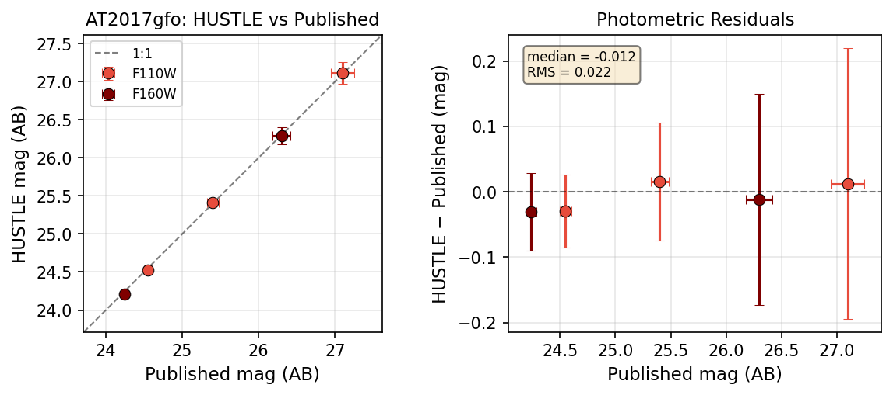
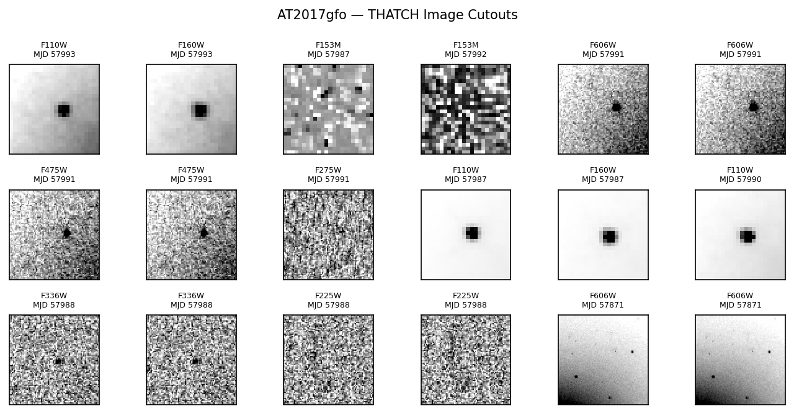
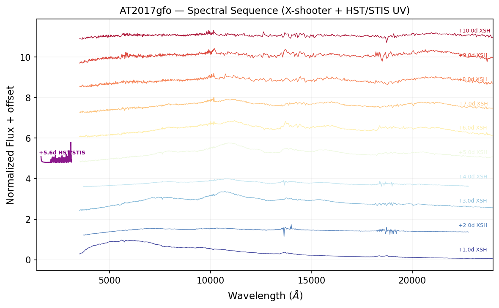
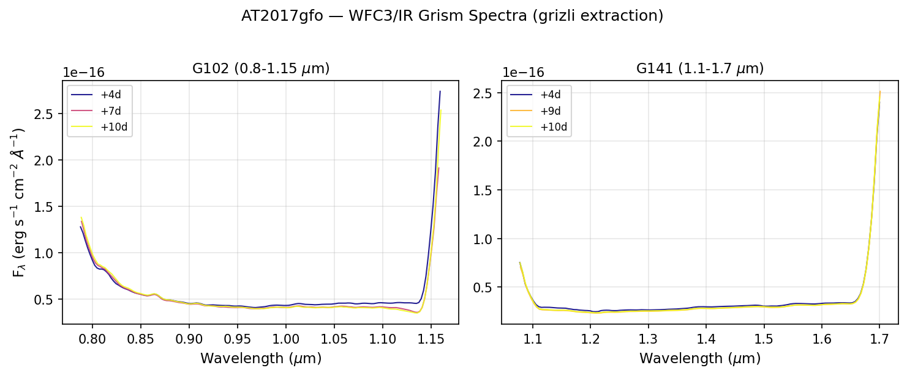
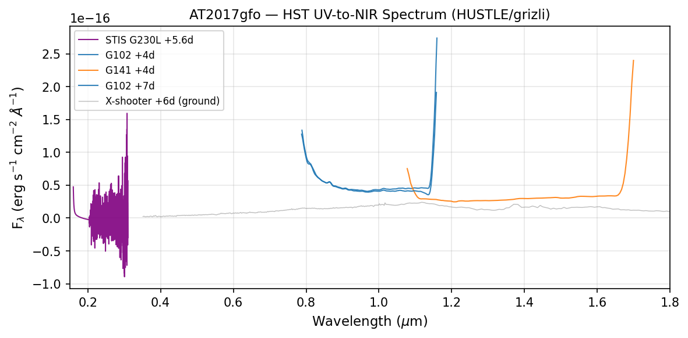

# AT2017gfo (Kilonova)

AT2017gfo is the electromagnetic counterpart of GW170817, the first binary neutron star merger detected by LIGO/Virgo. It has **229 HST observations** across 23 programs, including WFC3/IR grism spectroscopy — making it among the most densely observed transients in the HST archive.

## Photometric Validation

THATCH extracts multi-band photometry from F110W, F160W, F153M, F606W, F475W, F275W, F225W, and F336W observations spanning days 5–1273 post-merger. Comparison with published values demonstrates **0.02 mag RMS** accuracy:



*Left: 1:1 comparison of THATCH aperture photometry vs. published AB magnitudes from Cowperthwaite+2017 and Lyman+2018. Right: residuals consistent with zero (median = -0.012, RMS = 0.022 mag).*

## Image Cutouts

Multi-band cutouts show the kilonova clearly detected in the NIR and fading rapidly in the UV:



## Spectral Sequence

THATCH combines ground-based X-shooter spectra with HST UV (STIS) and NIR (WFC3 grism) spectroscopy to produce a complete spectral time series:



*Spectral sequence from +1 to +10 days post-merger. X-shooter covers 0.35–2.4 μm (ground-based). The HST/STIS G230L UV spectrum at +5.6d (purple) extends coverage to 1600 Å — wavelengths inaccessible from the ground.*

## Grism Extraction

WFC3/IR grism spectra extracted with grizli provide flux-calibrated NIR spectroscopy at 4 epochs:



*G102 (0.8–1.15 μm) and G141 (1.1–1.7 μm) grism spectra. Each epoch combines 4 dithered exposures with optimal extraction and contamination modeling.*

## Combined UV-to-NIR Spectrum

By combining all HST spectroscopic modes, THATCH produces continuous 0.15–1.7 μm coverage from a single observatory:



*AT2017gfo at ~5 days: STIS G230L (UV, purple) + WFC3 G102 (blue) + G141 (orange), overlaid with ground-based X-shooter (gray). This demonstrates that HST grism data provides the closest existing analog to Roman prism spectroscopy.*

## Reproducing This Example

```python
# Run the full AT2017gfo demo
python examples/demo_at2017gfo.py

# Extract grism spectra with grizli
python examples/extract_grism_grizli.py

# Plot spectral sequence with X-shooter comparison
python examples/plot_spectral_sequences.py
```
