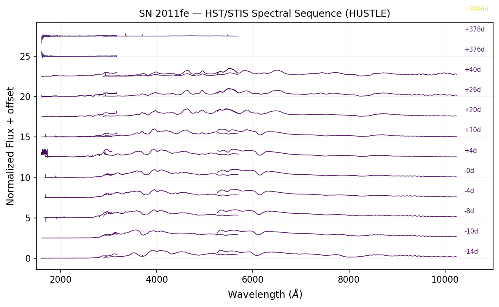

# SN 2011fe (Type Ia)

SN 2011fe in M101 is the best-studied nearby Type Ia supernova, with **292 HST observations** across 25 programs spanning 11.5 years. It serves as the primary validation benchmark for THATCH's spectroscopic pipeline.

## HST Spectral Sequence

THATCH extracted **71 STIS spectra** across 4 gratings (G230LB, G430L, G750L, G140L), spanning days -14 to +3996 relative to B-maximum. After merging duplicate exposures at the same epoch/grating, this produces 12 unique spectral epochs covering UV through NIR:



*HST/STIS spectral sequence of SN 2011fe from 14 days before to 11 years after B-band maximum. Each epoch combines UV (G230LB), optical (G430L), and red (G750L) gratings. The classic SN Ia spectral evolution is clearly visible: rising UV flux pre-maximum, prominent SiII 6150 Å and CaII H&K absorption, transition to iron-group emission in the nebular phase, and late-time COS/FUV detection at +3996 days.*

## Key Features Visible

- **Pre-maximum (-14d to 0d)**: Rising UV continuum, SiII 6150 Å absorption deepening
- **Post-maximum (+4d to +40d)**: UV fading, iron-group features emerging
- **Nebular (+376d, +378d)**: Forbidden [FeII], [FeIII], [CoIII] emission lines
- **Very late (+3996d)**: COS/FUV spectroscopy probing the SN remnant

## Why This Matters

This 12-epoch UV-optical spectral sequence is exactly the type of training data needed for Roman's multimodal classifiers. SN 2011fe demonstrates that THATCH can automatically extract, merge, and organize complex multi-grating spectroscopic monitoring campaigns from the HST archive.

## Reproducing This Example

```python
# Extract all STIS spectra
python examples/demo_sn2011fe.py

# Plot the spectral sequence
python examples/plot_spectral_sequences.py
```
