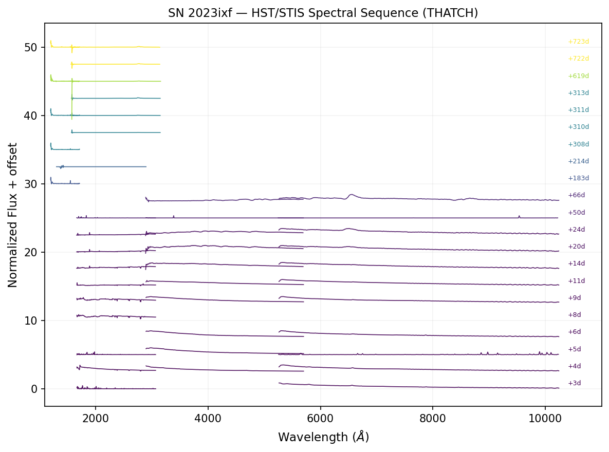

# SN 2023ixf (Type II)

SN 2023ixf in M101 is the closest core-collapse supernova in over a decade (d ~ 6.9 Mpc), discovered on 2023 May 19. It triggered an extensive HST DDT spectroscopic campaign spanning 4 programs and 2+ years.

## HST Spectral Sequence

THATCH extracted **121 STIS spectra** across 5 gratings from 4 HST programs, spanning days +3 to +723 post-explosion:

| Program | PI | Gratings | Epochs | Days |
|---------|-------|----------|--------|------|
| 17205 | DDT | G230LB, G430L, G750L | 5 | +3 to +11 |
| 17313 | GO | G230LB, G430L, G750L | 5 | +14 to +66 |
| 17497 | GO | G140L, G230L (COS) | 2 | +183 to +214 |
| 17610 | GO | G140L, G230L | 5 | +308 to +313 |
| 17772 | GO | G140L, G230L | 2 | +577 to +723 |

After merging duplicate exposures, this produces a 21-epoch spectral sequence covering FUV through optical:



*HST/STIS spectral sequence of SN 2023ixf from +3 to +723 days post-explosion. Five gratings (G140L, G230L, G230LB, G430L, G750L) provide continuous 1200–10000 Å coverage at each epoch. The UV flux evolution tracks the cooling photosphere, CSM interaction, and eventual nebular transition.*

## Science Highlights

- **Early UV (+3 to +11d)**: Dense G230LB coverage captures the early photospheric phase and potential CSM interaction signatures
- **UV evolution (+14 to +66d)**: Tracks the UV decline as the photosphere cools through hydrogen recombination
- **Late UV (+183 to +723d)**: FUV (G140L) and NUV (G230L) monitoring probes late-time interaction and the transition to the nebular phase

## Comparison with SN 2011fe

| Property | SN 2011fe (Ia) | SN 2023ixf (II) |
|----------|---------------|-----------------|
| HST spectra | 71 | 121 |
| Gratings | 4 (G140L, G230LB, G430L, G750L) | 5 (+G230L, COS) |
| Time span | −14 to +3996 d | +3 to +723 d |
| Epochs | 12 | 21 |

Together, these two objects demonstrate THATCH's ability to systematically extract and organize multi-year spectroscopic monitoring campaigns across different SN types — exactly the training data needed for Roman's multimodal classifiers.

## Reproducing This Example

```python
# Download spectra by program (avoids MAST timeouts)
from astroquery.mast import Observations
for prog in ["17205", "17313", "17497", "17610", "17772"]:
    obs = Observations.query_criteria(proposal_id=prog, obs_collection="HST")
    products = Observations.get_product_list(obs)
    # Filter to x1d/sx1 files and download...

# Process and save
from thatch.spectra import process_spectral_directory, save_spectra_hdf5
spectra = process_spectral_directory("data/SN2023ixf/spectra/")
save_spectra_hdf5(spectra, "SN2023ixf_spectra.hdf5", object_name="SN2023ixf")
```
