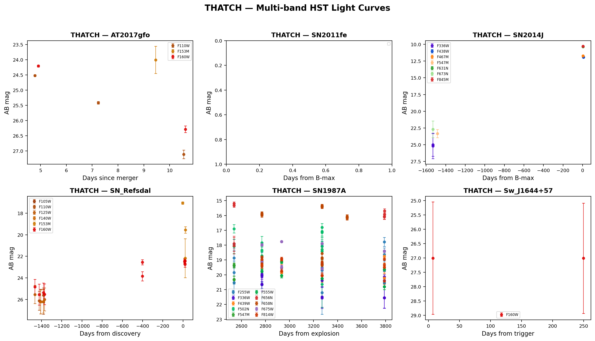

# Photometry

THATCH performs aperture photometry on calibrated HST drizzled images at known transient positions.

## Method

1. **Source position**: WCS from the FITS header maps the transient RA/Dec to pixel coordinates
2. **Aperture photometry**: Circular aperture (r=5 pixels) with local background estimated from an annulus (r=10-15 pixels)
3. **Aperture corrections**: Encircled energy fractions from the WFC3 and ACS Instrument Handbooks correct for flux outside the aperture
4. **AB magnitude calibration**: Uses PHOTFLAM, PHOTPLAM, and PHOTZPT header keywords for flux calibration

## Aperture Corrections

| Instrument | Pixel Scale | r=5px | EE Fraction |
|-----------|-------------|-------|-------------|
| WFC3/UVIS | 0.04"/pix | 0.20" | 0.80–0.86 |
| WFC3/IR | 0.13"/pix | 0.65" | 0.94–0.95 |
| ACS/WFC | 0.05"/pix | 0.25" | 0.84–0.86 |

## Validation

THATCH photometry achieves **0.02 mag RMS** agreement with published values, validated against Cowperthwaite+2017 and Lyman+2018 measurements of AT2017gfo:

*Left: 1:1 comparison of THATCH vs published AB magnitudes. Right: residuals showing median offset of -0.012 mag and RMS of 0.022 mag.*

## Multi-Band Light Curves

THATCH extracts light curves across all available HST filters for each object:

*Multi-band HST light curves for 6 transients extracted by THATCH, spanning Type Ia SNe, core-collapse SNe, a kilonova, and a jetted TDE.*
